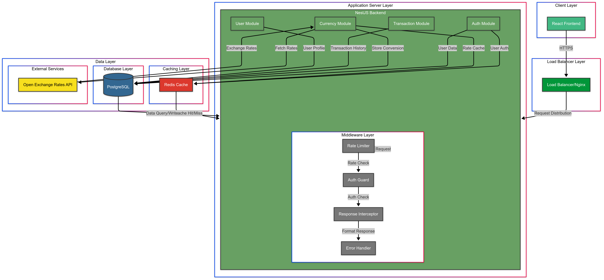
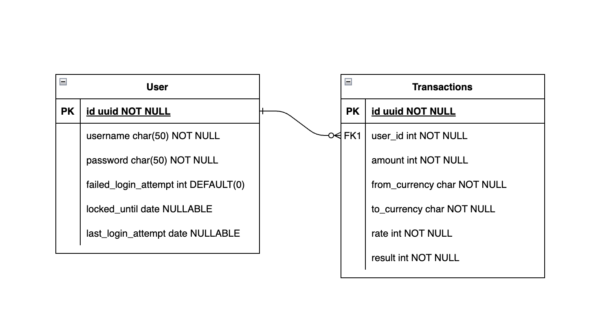
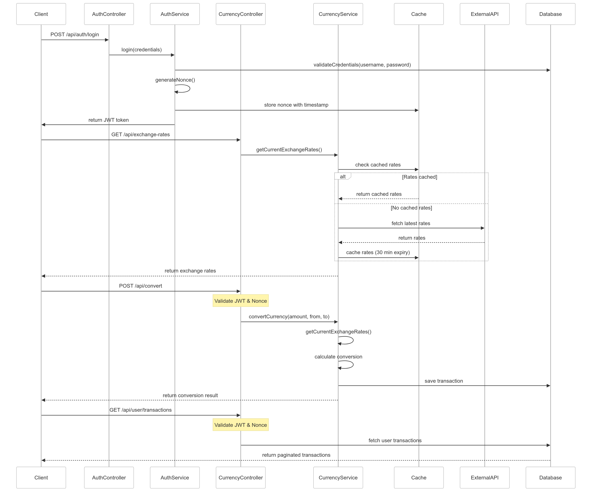

# We Wire - Currency Conversion Platform

A full-stack currency conversion platform built with NestJS and React, featuring secure authentication, real-time currency conversion, and comprehensive transaction tracking.

## Demo

<video width="100%" controls>
  <source src="https://pub-bac1839243454103b0992ac4d61bd168.r2.dev/2025-03-18%2006-24-10.mp4" type="video/mp4">
  Your browser does not support the video tag.
</video>

## Project Overview

We Wire is a modern currency conversion platform that allows users to:

- Perform secure currency conversions
- Track conversion history
- Access real-time exchange rates
- Manage their transactions through a user-friendly dashboard

## Architecture

### System Flow



### Data Model



### Request Flow



## Project Structure

This project is organized into two main directories:

- `backend/` - NestJS backend application
- `frontend/` - React frontend application built with Vite

## Core Features

### Backend Features

- **Authentication & Security**

  - Secure JWT-based authentication
  - Protection against replay attacks
  - Rate limiting middleware
  - CORS protection
  - Secure headers implementation

- **Currency Operations**

  - Real-time exchange rates integration
  - Currency conversion functionality
  - Transaction history tracking
  - PostgreSQL data persistence

- **API Endpoints**
  - POST /api/auth/login - User authentication
  - GET /api/exchange-rates - Current exchange rates
  - POST /api/convert - Currency conversion
  - GET /api/user/transactions - Transaction history

### Frontend Features

- **User Interface**

  - Responsive design with Tailwind CSS
  - Interactive currency converter
  - Transaction history dashboard
  - User-friendly error handling

- **Technical Features**
  - RTK Query for state management
  - Form validation with react-hook-form
  - Reusable UI components
  - TypeScript integration

## Tech Stack

### Backend

- NestJS with TypeScript
- PostgreSQL database
- TypeORM for database management
- JWT for authentication
- Class-validator for DTO validation
- Jest for testing

### Frontend

- React 18+
- TypeScript
- Vite
- RTK Query
- React Hook Form
- Tailwind CSS
- React Router

## Getting Started

### Prerequisites

- Node.js (v16 or higher)
- PostgreSQL
- pnpm (preferred) or npm

### Backend Setup

1. Navigate to the backend directory:
   ```bash
   cd backend
   ```
2. Install dependencies:
   ```bash
   pnpm install
   ```
3. Create a .env file with necessary environment variables (see .env.example)
4. Run database migrations:
   ```bash
   pnpm run migration:run
   ```
5. Start the development server:
   ```bash
   pnpm run start:dev
   ```

### Frontend Setup

1. Navigate to the frontend directory:
   ```bash
   cd frontend
   ```
2. Install dependencies:
   ```bash
   pnpm install
   ```
3. Start the development server:
   ```bash
   pnpm run dev
   ```

## Security Features

- Protection against replay attacks using nonces
- Timestamped JWT tokens with short validity
- Rate limiting to prevent API abuse
- Secure headers implementation
- CORS configuration
- Request sanitization
- Request size limiting

## Testing

### Backend Tests

```bash
cd backend
pnpm run test        # Unit tests
pnpm run test:e2e    # E2E tests
pnpm run test:cov    # Test coverage
```

## API Documentation

The API documentation is available [here](https://documenter.getpostman.com/view/24185831/2sAYkDMfuP)

## Contributing

1. Fork the repository
2. Create a feature branch
3. Commit your changes
4. Push to the branch
5. Create a Pull Request

## License

This project is licensed under the MIT License - see the LICENSE file for details.
